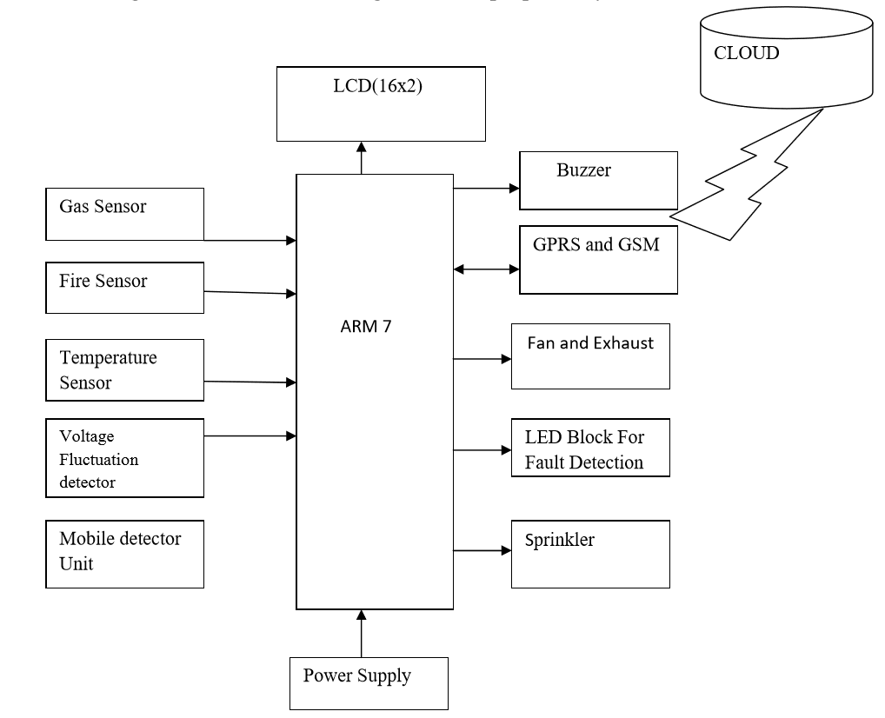

# Industrial-Safety-Automation
 A Project on automating Industrial safety operation using IoT 
 
 ## Aim
The aim of the project was to design an autonomous system that would monitor few parameters which could harm the industry / the workers, and which would take remedial action upon any threat. The parameters monitored for this project were fire, gas, temperature, radiation and voltage fluctuation. The system also required to update real-time readings of the parameters to a remote cloud and send message to the subscribed number, if a threat was detected.
 
 ---
 
 ## Hardware
 The following hardware components were used for this project,  
 1. ARM7-LPC2148 Microcontroller
 2. Temperature Sensor (LM 35) 
 3. Fire Sensor (EE522)
 4. Gas Sensor (MQ2)
 5. Mobile Detector Circuit 
 6. Liquid Crystal Display 
 7. Sprinkler and buzzer 
 8. GSM module
 9. WIFI Module (ESP 8266)
 10. Volatge regulator (IC 7805)
 11. Variable voltage supply module (LM 317)
 12. Relay
 
 ----
 
 ## Software
 The majority of the code was written in C. The HTML code was written to make the cloud based website fit our needs to display the 
 values real time when the wifi module sends in data.  
 
 ---
 
 ## Approach
 
 First, the block diagram of the system was created to understand briefly how the system needed to be put in place. The block diagram
 prepared is shown below,
 
 
 
 Next, a flow diagram was created. The flow diagram is shwon below,
 
  
  
  With the understanding of what we require the system to do, we then had to study the interface diagram of the ARM7 LPC 2148 to know 
  which pins could be used to interface the components together with the board. The ARM7 LPC 2148 looks ash shown,
  
  Pin diagram:  
  
  
  Interface diagram:  
  
  
  
  ---
  
  ## The Setup
  
  The system was soldered together based on the interface diagram. The system is shown below,
  
  
  
  ---
  
  ## Results
  
  The system was tested succesfully and the results are shown below,
  
  Gas:  
    
  
  Fire:  
    
  
  Temperature:  
    
  
  Voltage:  
    
  
 
 
 
 
 
 
